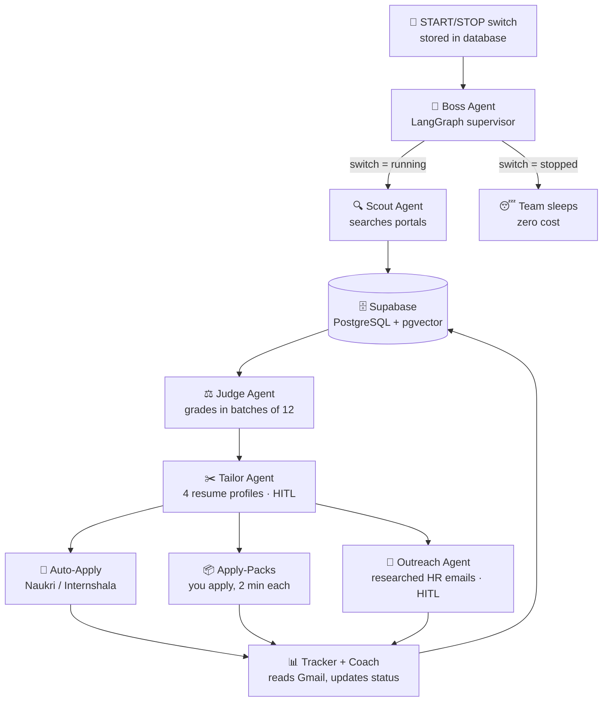

# 🚀 JobPilot — Autonomous Multi-Agent Job-Search System

> An AI agent team that searches job portals and grades every role against my profile — the foundation of a system designed to run daily on its own, with me in control of every decision that matters. (Resume-tailoring, outreach, and tracking agents are on the roadmap below.)

Built with **LangGraph** (multi-agent orchestration), **Supabase/PostgreSQL** (data, with a pgvector column ready for RAG), and a **multi-provider LLM fallback chain** (Gemini → Groq) that makes the system resilient to free-tier rate limits.

**Status:** 4 of the planned agents are built and working (Boss, Scout, Judge, Notifier). See the roadmap for what's next.

---

## Why I built this

Job hunting as a fresher means repeating the same exhausting loop every single day: search five portals, read hundreds of listings, guess which ones fit, rewrite your resume, chase HR emails, and try to remember what you applied to. I wanted a system that does the repetitive 90% automatically but **never takes an irreversible action** — sending an email, submitting an application, editing my resume — **without my explicit approval.**

That principle (**human-in-the-loop**) shaped the whole architecture.

---

## Architecture



Each agent is a **node in a LangGraph state machine**. The Boss checks a master switch before any work happens, so the whole team can be paused for months and resumed with one click — the design that lets this run for years, not weeks.

---

## Key engineering decisions

| Decision | Problem it solves |
|---|---|
| **Batched LLM grading** (12 jobs per call) | The naive 1-call-per-job approach made 187 API calls per run and exhausted free-tier quota mid-run. Batching cut it to ~16 calls — a **~90% reduction** — and ended the crashes. |
| **Multi-provider fallback chain** (2 Gemini keys × 2 models → Groq) | When Google's free tier is rate-limited, the system automatically fails over to Groq (a different provider with a separate quota) instead of dying. |
| **Adapter pattern for portals** | Each job site is one self-contained function. Adding a new portal in the future = adding one file; the agents' logic never changes. |
| **Human-in-the-loop (HITL)** | AI proposes resume edits and outreach emails, but nothing is sent or saved without explicit approval. My words, my decisions. |
| **Single database access layer** | Every agent talks to the DB through one module, so the storage backend can be swapped without touching agent code. |
| **RAG-based grading** (embeddings + retrieval) | The resume is chunked and embedded (Gemini `gemini-embedding-001`, 768-dim); for each job the description is embedded and the most semantically similar resume chunks are retrieved by cosine similarity and handed to the Judge as evidence — so grades cite real projects, not keyword guesses. *(pgvector column is in place to move similarity search into the database.)* |

---

## Tech stack

- **Orchestration:** LangGraph (multi-agent state machine)
- **Language:** Python 3.12
- **Database:** Supabase (PostgreSQL) + pgvector for embeddings
- **LLMs:** Google Gemini (`flash-lite`/`flash`) with Groq (`llama-3.3-70b`) fallback
- **Scraping:** JobSpy (LinkedIn/Indeed), Playwright (Naukri), BeautifulSoup (Internshala)
- **Web (in progress):** Django dashboard
- **Deployment target:** Oracle Cloud always-free VM (24/7, laptop-independent)

---

## The agent team

| Agent | Responsibility |
|---|---|
| **Boss** | Supervisor. Reads the START/STOP switch, coordinates the workflow, records each run's result. |
| **Scout** | Searches LinkedIn, Indeed, Naukri, Internshala (more via adapters). Stores new jobs, skips duplicates. |
| **Judge** | Grades each job A–F against my profile with evidence, flags experience mismatches and scam signals. |
| **Tailor** *(building)* | Picks the right resume profile (Data Scientist / ML / Analyst / GenAI), proposes keyword edits for approval. |
| **Applier** *(building)* | Auto-applies where safe; builds ready-to-submit apply-packs for the rest. |
| **Outreach** *(building)* | Researches a company + HR contact, drafts a personalized email for my approval. |
| **Tracker + Coach** *(building)* | Reads Gmail for recruiter replies, updates application status, surfaces skills to learn. |

---

## Results from a real run

```
187 jobs found  (LinkedIn + Indeed + Internshala)
187 graded in ~16 AI calls  (batched)
 27 Grade A matches surfaced
  0 crashes · 0 quota failures
```

---

## Project structure

```
JobPilot/
├── run_agent.py            # entry point: --start / --stop / --status / run
├── agents/
│   ├── boss.py             # LangGraph supervisor + START/STOP
│   ├── scout.py            # portal search (adapter pattern)
│   ├── judge.py            # batched grading + scam checks
│   └── notifier.py         # daily email of top jobs
├── core/
│   ├── config.py           # all settings
│   ├── db.py               # single database access layer
│   ├── llm.py              # multi-provider fallback chain
│   └── keepalive.py        # keeps the free-tier DB awake
├── database/schema.sql     # 8-table schema (jobs, applications, rounds,
│                           #   outreach, resumes, skill gaps, reports, logs)
└── legacy/                 # earlier proven scraping code, wrapped as an adapter
```

---

## Setup

See [`SETUP.md`](SETUP.md) for full steps. In short:

1. Create a Supabase project, run `database/schema.sql`
2. Copy `.env.example` → `.env` and fill in your keys (Supabase, Gemini, Groq, Gmail)
3. `pip install -r requirements.txt`
4. `python run_agent.py --start && python run_agent.py`

> **Security note:** `.env` and all personal data (CV, application history) are git-ignored and never leave your machine.

---

## Roadmap

- [x] Multi-agent core (Boss, Scout, Judge) on LangGraph
- [x] Batched grading + LLM fallback chain
- [x] RAG: resume embedding + retrieval feeding evidence into grading
- [x] Daily email digest
- [x] Tailor, Applier, Outreach, Tracker agents (all human-in-the-loop)
- [x] Django dashboard: Command Center (START/STOP), Today's Jobs, Application Tracker, Outreach Book, Resume Studio
- [ ] Live auto-submit + auto-send (currently prepared and approval-gated by design)
- [ ] Weekly intelligence report, interview-prep agent
- [ ] Deploy to Oracle Cloud free tier (fully laptop-independent)

---

*Built by Vasavi Annapureddy — B.Tech CSE (AI & ML).*
